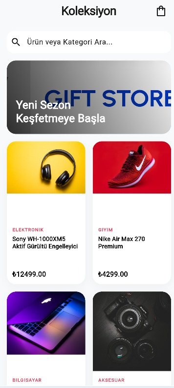
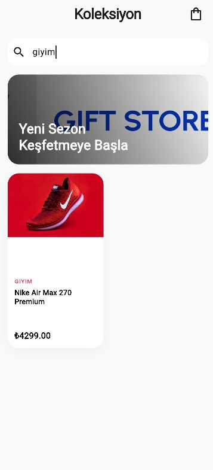
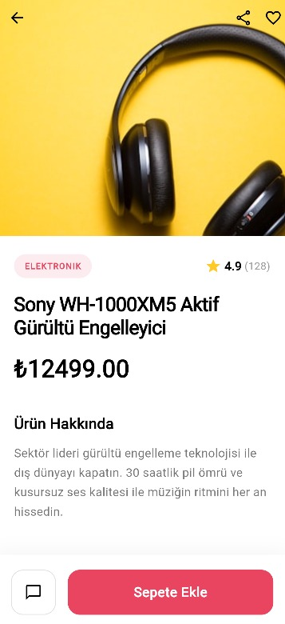
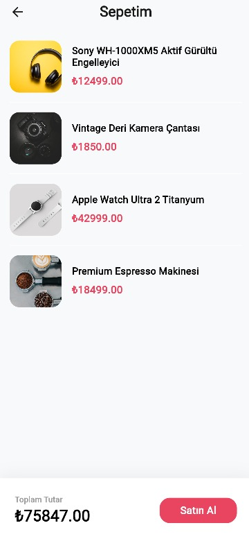

# Mini Katalog Uygulaması

Flutter Günlük Eğitim haftası bitirme projesi olarak geliştirilmiş temel seviye e-ticaret/katalog uygulaması. Eğitimdeki tüm isterleri (%100) eksiksiz olarak karşılayacak şekilde, baştan aşağıya profesyonel bir tasarımla hazırlanmıştır.

## 📱 Proje Özellikleri (İstenen Tüm Çıktılar)
* **Kullanılan Sürüm:** Flutter SDK (En güncel stabil sürüm kullanılmıştır)
* **Widget Yapısı:** Stateless ve Stateful widget'ların amaca uygun kullanımı.
* **Navigasyon:** `Navigator.push`, `Navigator.pop` ve Named Routes (`/detail`) kullanımı. Route Arguments ile sayfalar arası veri taşıma işlemleri.
* **Tasarım:** Sadece `material.dart` paketi kullanılarak yapılmış, GridView ile kart tabanlı ürün listeleme ve şık detay sayfası tasarımı.
* **Sepet Simülasyonu:** Ürün detayından sepete ürün ekleme ve uygulamanın state'inin güncellenerek ayrı bir ListView sayfasında toplanması işlemi.
* **Arama Sistemi:** `TextField` kullanılarak ürünler arası filtreleme yeteneği.
* **Veri & Asset Yönetimi:** Eğitim gereği dummy veriler kullanılmış olup, json verisi (`products.json`) ve banner görseli (`banner.png`) projede `assets/` klasöründen `Image.asset` mantığı ile çekilmiştir.

## 🚀 Çalıştırma Adımları

Projeyi bilgisayarınızda veya emulator'da çalıştırmak için:

1. Proje dizininde terminali açın.
2. Paketleri yüklemek için şu komutu girin:
   ```bash
   flutter pub get
   ```
3. Uygulamayı başlatmak için:
   ```bash
   flutter run
   ```

## 📸 Ekran Görüntüleri





